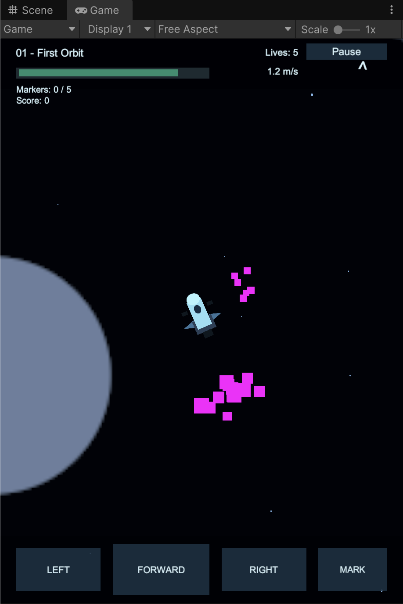
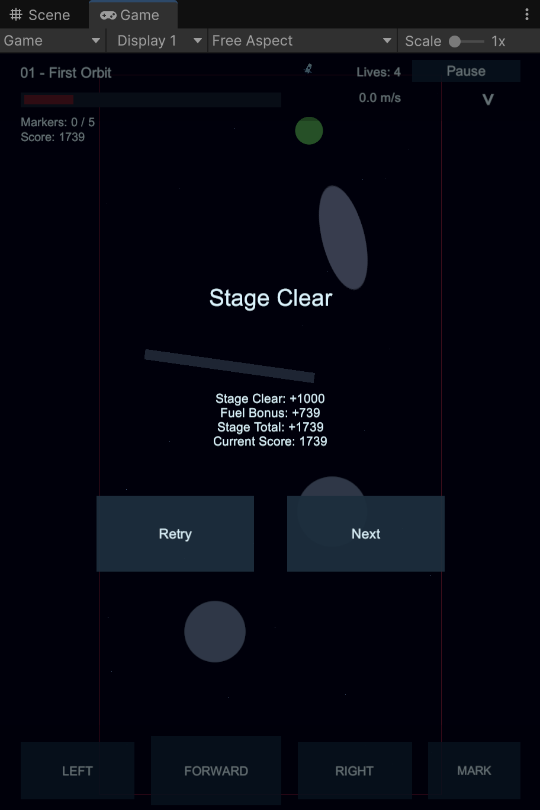
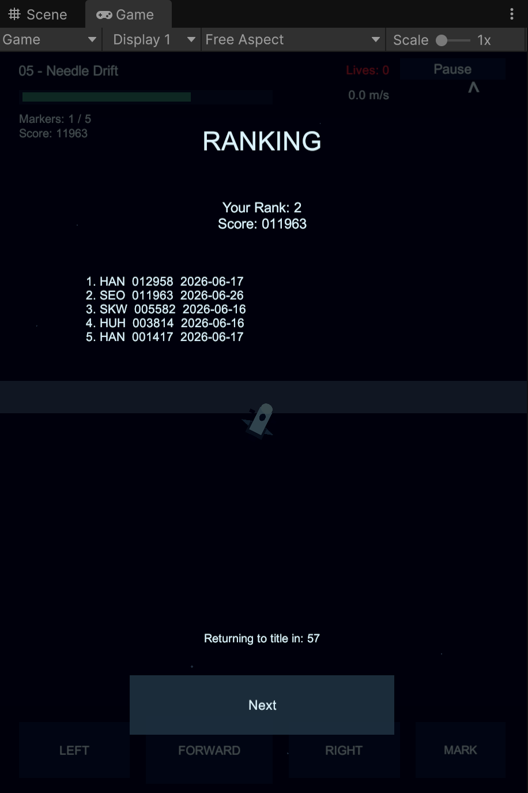

# Blind Orbit

Blind Orbit은 보이지 않는 우주 장애물을 피해 목적지까지 이동하는 2D 관성 퍼즐 게임 프로토타입입니다. 플레이어는 제한된 연료로 우주선을 회전시키고 전진 추력을 사용해 목표 지점에 도달해야 합니다.

## 프로젝트 정보

- 엔진: Unity 6000.4.10f1
- 렌더링: Universal Render Pipeline 2D
- 입력: Unity Input System
- 화면 방향: Portrait
- 주요 씬:
  - `Assets/Scenes/Loading Scene.unity`
  - `Assets/Scenes/Title Scene.unity`
  - `Assets/Scenes/Game Scene.unity`

## 게임 특징

- 관성 기반 우주선 이동
- 제한된 연료와 연료 보너스 점수
- 총 10개의 수제 프로토타입 스테이지
- 실패 시 충돌 지점 주변을 보여주는 리빌 연출
- 경로 기억을 돕는 마커 시스템
- 생명, 점수, 이름 입력, 로컬 랭킹 저장

## 스크린샷

| 플레이 | 스테이지 클리어 | 랭킹 |
| --- | --- | --- |
|  |  |  |

## 조작

### 키보드

- `A` 또는 `←`: 왼쪽 회전
- `D` 또는 `→`: 오른쪽 회전
- `W` 또는 `↑`: 전진 추력
- `↓`: 현재 위치에 마커 배치
- `Space` 또는 `Enter`: 타이틀 화면에서 시작

### 마우스/터치

- 타이틀 화면 터치 또는 클릭: 시작
- 하단 UI 버튼:
  - `LEFT`: 왼쪽 회전
  - `FORWARD`: 전진 추력
  - `RIGHT`: 오른쪽 회전
  - `MARK`: 마커 배치

## 실행 방법

1. Unity Hub에서 이 폴더를 프로젝트로 엽니다.
2. Unity 버전은 `6000.4.10f1`을 권장합니다.
3. `Assets/Scenes/Loading Scene.unity`를 열거나 Build Settings의 첫 씬부터 실행합니다.
4. 에디터에서 Play를 누르면 로딩 화면, 타이틀 화면, 게임 화면 순서로 진행됩니다.

## 폴더 구조

- `Assets/Scenes`: 게임 씬
- `Assets/Scripts/Core`: 게임 상태 정의
- `Assets/Scripts/Gameplay`: 플레이어, 연료, 목표, 장애물, 스테이지 데이터
- `Assets/Scripts/Managers`: 게임 흐름, 스테이지, 카메라, 오디오, 저장, 점수, 랭킹 관리
- `Assets/Scripts/UI`: 런타임 생성 UI
- `Assets/Scripts/Utility`: 임시 스프라이트 생성 유틸리티
- `Assets/Docs`: 프로토타입 계획 및 성능 조사 문서
- `Docs`: README용 게임 스크린샷
- `Assets/FREE 2D Spaceships Pack`, `Assets/2D pixel asteroids`: 외부/임시 아트 에셋

## 개발 메모

현재 게임 오브젝트, UI, 스테이지는 대부분 런타임에 자동 생성됩니다. 첫 플레이 가능한 프로토타입의 감각을 검증하기 위한 구조이며, 조작감과 스테이지 구성이 안정되면 런타임 생성 오브젝트를 프리팹과 정식 아트 리소스로 교체할 수 있습니다.

## 참고 문서

- `Assets/Docs/BlindOrbit_PrototypePlan.md`
- `Assets/Docs/BlindOrbit_PerformanceAudit.md`
- `Assets/Docs/BlindOrbit_ThermalInvestigation.md`
