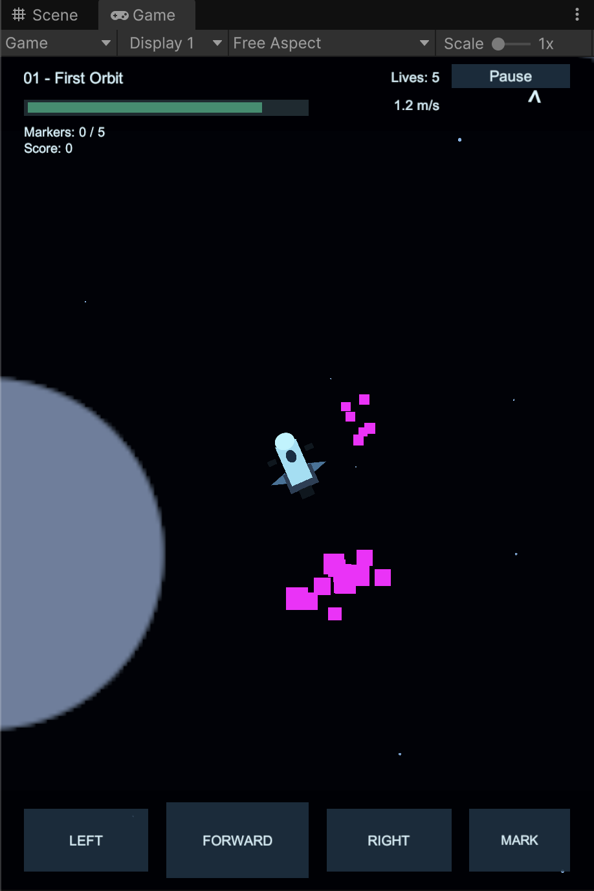
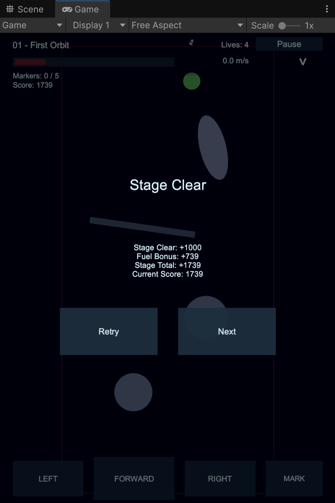
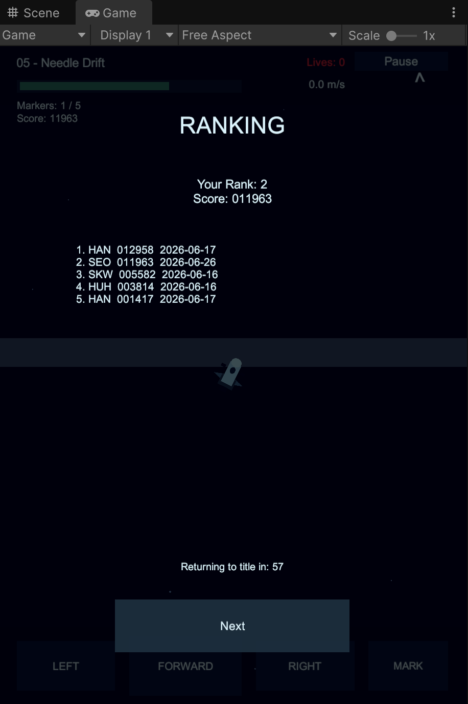

# Blind Orbit

Blind Orbit은 보이지 않는 우주 장애물을 피해 목적지까지 이동하는 2D 관성 퍼즐 게임 프로토타입입니다. 플레이어는 제한된 연료로 우주선을 회전시키고 전진 추력을 사용해 목표 지점에 도달해야 합니다.

## 프로젝트 정보

- 엔진: Unity 6000.4.10f1
- 렌더링: Universal Render Pipeline 2D
- 입력: Unity Input System
- 화면 방향: Portrait
- 주요 씬:
  - `Assets/Scenes/Loading Scene.unity`
  - `Assets/Scenes/Title Scene.unity`
  - `Assets/Scenes/Game Scene.unity`

## 게임 특징

- 관성 기반 우주선 이동
- 제한된 연료와 연료 보너스 점수
- 총 10개의 수제 프로토타입 스테이지
- 실패 시 충돌 지점 주변을 보여주는 리빌 연출
- 경로 기억을 돕는 마커 시스템
- 생명, 점수, 이름 입력, 로컬 랭킹 저장
- 일반 지형과 중력, 워프, 가속, 연료 간섭 장치를 조합한 장애물 시스템

## 스크린샷

| 플레이 | 스테이지 클리어 | 랭킹 |
| --- | --- | --- |
|  |  |  |

## 조작

### 키보드

- `A` 또는 `←`: 왼쪽 회전
- `D` 또는 `→`: 오른쪽 회전
- `W` 또는 `↑`: 전진 추력
- `↓`: 현재 위치에 마커 배치
- `Space` 또는 `Enter`: 타이틀 화면에서 시작

### 마우스/터치

- 타이틀 화면의 `START`: 게임 시작
- 타이틀 화면의 `HOW TO PLAY`: 조작법과 장애물 안내 열기
- 하단 UI 버튼:
  - `LEFT`: 왼쪽 회전
  - `FORWARD`: 전진 추력
  - `RIGHT`: 오른쪽 회전
  - `MARK`: 마커 배치

## 장애물과 장치

일반 장애물은 닿으면 즉시 스테이지 실패로 처리됩니다. 장치형 오브젝트는 일정 범위에 진입했을 때 이동이나 연료에 영향을 주며, 종류에 따라 충돌 없이 통과할 수 있습니다.

| 종류 | 동작 | 게임 화면에서 구분하는 방법 |
| --- | --- | --- |
| 원형 소행성 (`CircleAsteroid`) | 닿으면 우주선이 파괴되는 기본 원형 장애물입니다. | 회청색의 크고 둥근 암석 형태입니다. |
| 타원형 소행성 (`EllipseAsteroid`) | 길쭉한 충돌 영역으로 좁은 비행 경로를 만듭니다. | 일반 소행성과 같은 회청색이지만 한쪽 방향으로 길게 늘어나 있습니다. |
| 긴 벽 (`LongWall`) | 얇고 긴 직선형 충돌 장애물입니다. 배치 각도에 따라 항로를 차단합니다. | 어두운 회청색의 가늘고 긴 막대 형태입니다. |
| 중공 링 (`HollowRing`) | 링의 테두리에 닿으면 파괴되지만 중앙의 빈 공간은 통과할 수 있습니다. | 여러 회색 조각이 원형 테두리를 이루며 중앙이 비어 있습니다. |
| 미로 구조물 (`MazeStructure`) | 여러 벽이 연결되어 막힌 길과 좁은 통로를 만듭니다. | 회청색 벽 여러 개가 꺾인 미로 형태로 배치됩니다. |
| 블랙홀 (`BlackHole`) | 영향 범위 안의 우주선을 중심 방향으로 끌어당깁니다. 중심에 가까울수록 항로 유지가 어려워집니다. | 보라색 중력 영역, 밝은 보라색 링, 검은 중심으로 표시됩니다. |
| 워프홀 (`WarpHole`) | 진입한 우주선을 스테이지에 지정된 다른 위치로 순간이동시킵니다. 연속 워프 방지를 위한 짧은 재진입 대기시간이 있습니다. | 청록색 외곽 영역과 보라색 코어, 밝은 워프 링으로 구분됩니다. |
| 공전 장애물 (`OrbitingObstacle`) | 지정된 중심과 거리를 유지하며 계속 공전하는 충돌 장애물입니다. | 주황색 소행성과 이동 경로를 보여주는 주황색 점선 궤도가 표시됩니다. |
| 자전 장애물 (`RotatingObstacle`) | 한 지점을 중심으로 계속 회전하며 닿으면 우주선을 파괴합니다. | 붉은색 막대 양 끝에 노란색 경고 표시가 있습니다. |
| 부스터 (`Booster`) | 진입 순간 화살표 방향으로 우주선에 추가 가속을 부여합니다. | 반투명 녹색 영역 안의 밝은 진행 화살표와 속도선으로 표시됩니다. |
| 연료 흡수 장치 (`FuelDrain`) | 영향 범위 안에 머무는 동안 우주선의 연료를 지속해서 감소시킵니다. | 적색·주황색 원형 영역, 주황색 링과 중앙의 마이너스 기호로 표시됩니다. |

### 게임 내 장애물 안내 UI

타이틀 화면의 `HOW TO PLAY` 버튼을 누르면 두 페이지로 구성된 안내 화면을 열 수 있습니다.

1. `CONTROLS & SOLID OBSTACLES`: 비행 조작과 일반 충돌 장애물을 설명합니다.
2. `SPACE DEVICES`: 블랙홀, 워프홀, 공전·자전 장애물, 부스터, 연료 흡수 장치를 설명합니다.

안내 화면의 아이콘은 실제 게임 오브젝트와 같은 대표 색상과 형태를 사용합니다. `PREV`와 `NEXT`로 페이지를 이동하고 `CLOSE` 또는 `Esc`로 타이틀 화면에 돌아갈 수 있습니다.

## 실행 방법

1. Unity Hub에서 이 폴더를 프로젝트로 엽니다.
2. Unity 버전은 `6000.4.10f1`을 권장합니다.
3. `Assets/Scenes/Loading Scene.unity`를 열거나 Build Settings의 첫 씬부터 실행합니다.
4. 에디터에서 Play를 누르면 로딩 화면, 타이틀 화면, 게임 화면 순서로 진행됩니다.

## 폴더 구조

- `Assets/Scenes`: 게임 씬
- `Assets/Scripts/Core`: 게임 상태 정의
- `Assets/Scripts/Gameplay`: 플레이어, 연료, 목표, 장애물, 스테이지 데이터
- `Assets/Scripts/Managers`: 게임 흐름, 스테이지, 카메라, 오디오, 저장, 점수, 랭킹 관리
- `Assets/Scripts/UI`: 런타임 생성 UI
- `Assets/Scripts/Utility`: 임시 스프라이트 생성 유틸리티
- `Assets/Docs`: 프로토타입 계획 및 성능 조사 문서
- `Docs`: README용 게임 스크린샷
- `Assets/FREE 2D Spaceships Pack`, `Assets/2D pixel asteroids`: 외부/임시 아트 에셋

## 개발 메모

현재 게임 오브젝트, UI, 스테이지는 대부분 런타임에 자동 생성됩니다. 첫 플레이 가능한 프로토타입의 감각을 검증하기 위한 구조이며, 조작감과 스테이지 구성이 안정되면 런타임 생성 오브젝트를 프리팹과 정식 아트 리소스로 교체할 수 있습니다.

## 참고 문서

- `Assets/Docs/BlindOrbit_PrototypePlan.md`
- `Assets/Docs/BlindOrbit_PerformanceAudit.md`
- `Assets/Docs/BlindOrbit_ThermalInvestigation.md`
